<p align="center">
  
  <br><br>
    <p align="center">
      
      
      <br>
      <a href="https://www.paypal.com/paypalme/TommyZambrano">
        
      </a>
      <a href="https://ko-fi.com/mrdemonc">
        
      </a>
      <a href="https://github.com/MrDemonc/Lune#-monero-xmr">
        
      </a>
    </p>
    <p align="center">
      Lune is a minimalist and elegant music player for Android, designed with a focus on aesthetics and a premium user experience. 
      It features a modern Jetpack Compose UI, dynamic color support, and a unique high-quality dark defocus widget system.
    </p>
</p>

## 🔒 Privacy & Security

Lune is built with privacy as a core principle:

- **Zero Internet Access**: The app does not hold the `INTERNET` permission. It never connects to any network, server, or service.
- **No Trackers**: Zero analytics SDKs, no telemetry, no crash reporters, no ads — nothing phones home.
- **100% Offline**: All audio is played from your device's local storage. No streaming, no account required, no cloud dependency.
- **No Data Collection**: Lune does not collect, store, or transmit any personal data. Everything stays on your device.
- **Open Source**: The entire source code is publicly available for audit. What you see is what you get.
- **Minimal Permissions**: Only the permissions strictly necessary for local music playback and audio visualization are requested.

## 📱 F-Droid Information

Lune is designed to be fully open-source and compatible with F-Droid's build standards:

- **Pure Gradle Build**: No proprietary pre-compiled binaries.
- **Standard Metadata**: Compatible with F-Droid build recipes.

**Get app in:**

[](https://f-droid.org/es/packages/com.demonlab.lune/)

## ✨ Features

- **Modern UI**: Built with Jetpack Compose for a fluid, responsive interface.
- **Premium Widget**: Home screen widget featuring a professional "dark defocus" effect powered by RenderScript.
- **Live Lyrics**: Integrated lyrics viewer with synchronized scrolling and smooth animations.
- **Dynamic Themes**: Responsive to system color schemes and dark mode.
- **Queue Control**: Robust playback management with shuffle, repeat, and queue persistence.
- **Playlist**: The ability to create your own playlists with the music you like, separate from the rest.
- **Automix and Crossfade**: 12-second transition effect when changing songs, for a smooth transition.
- **Timer**: Set a timer to turn off playback; available times: off, 15m, 30m, 60m.
- **Equalize**: It includes a 10-band equalizer with several preset modes, plus advanced audio processing tools:
  - **Bass Boost**: Extra low-end enhancement beyond the EQ bands. Works as an invisible offset — the sliders stay put but the hardware gets a boost.
  - **Spatial Audio**: Virtual widening of the soundstage using Android's `Virtualizer` effect. Smooth ramp on toggle for a natural transition.
  - **Loudness Enhancer**: Boosts the perceived loudness of your audio without clipping. Uses Android's `LoudnessEnhancer` to make quiet passages more audible while preserving dynamic integrity. Adjustable gain from 0 to 30 dB.
  - **Balance**: Adjusts the stereo panorama between left and right channels. The on-screen indicator shows L (full left), C (center), or R (full right). A reset button snaps back to center instantly. Applied in real time during playback and preserved across track transitions.
  - **Reverb**: Simulates different acoustic spaces around your audio — from a small Room to a large Concert Hall. Built on `EnvironmentalReverb` (API 31+) with `PresetReverb` fallback on older devices. Six environments available: Room, Hall, Plate, Stage, Arena, and Cathedral. Works independently of the equalizer.
  - **Pitch**: Changes the playback speed and pitch from 0.5x (slow, deep) to 2.0x (fast, high). Speed and pitch move together via Android's `PlaybackParams`. Useful for voice study, instrumental practice, or just having fun with songs.
  - **Dynamics Processor**: Compresses the dynamic range — the gap between the quietest and loudest parts. Five presets:
    - _Light_ (1.5:1 ratio, gentle smoothing)
    - _Medium_ (3:1 ratio, general purpose)
    - _Strong_ (5:1 ratio, heavy compression with limiting)
    - _Night_ (8:1 ratio, aggressive compression + limiter — ideal for late-night listening without disturbing others)
      Uses Android's `DynamicsProcessing` with multi-band compression (MBC) and a hard limiter. Independent of the EQ.
- **Vizulizer**: Bar display that moves to the rhythm of the music.
- **Sample button theme**: A simple button that allows you to change the application's light or dark mode (includes automatic mode, taking the system mode).
- **HI-FI audio**: The application supports audio in HI-FI formats.
- **Language**: Available in Spanish and English.
- **Custom tittle**: Customize the application title from the settings.

## 📱 ScreenShot

<p align="center">
  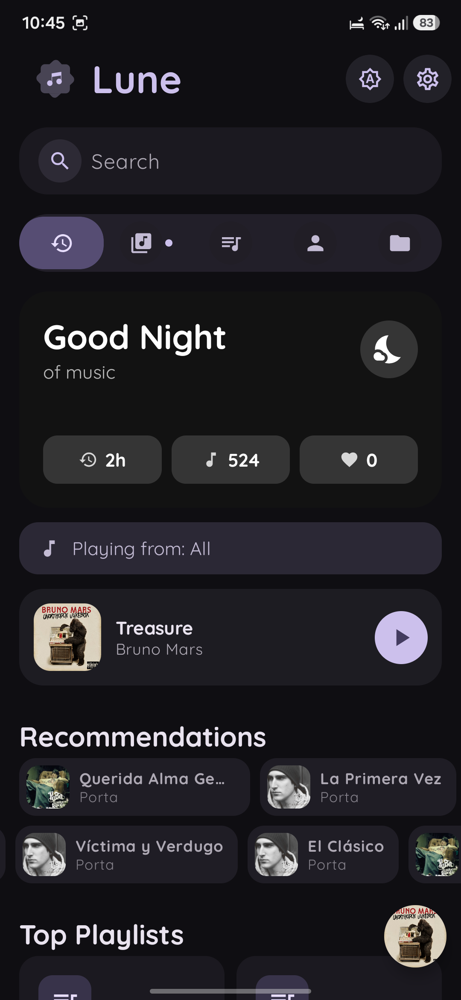
  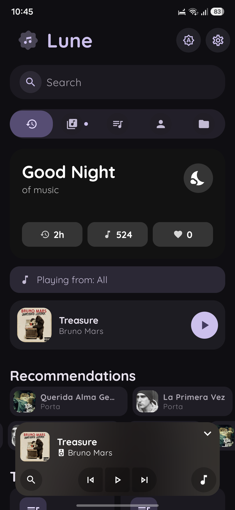
  
  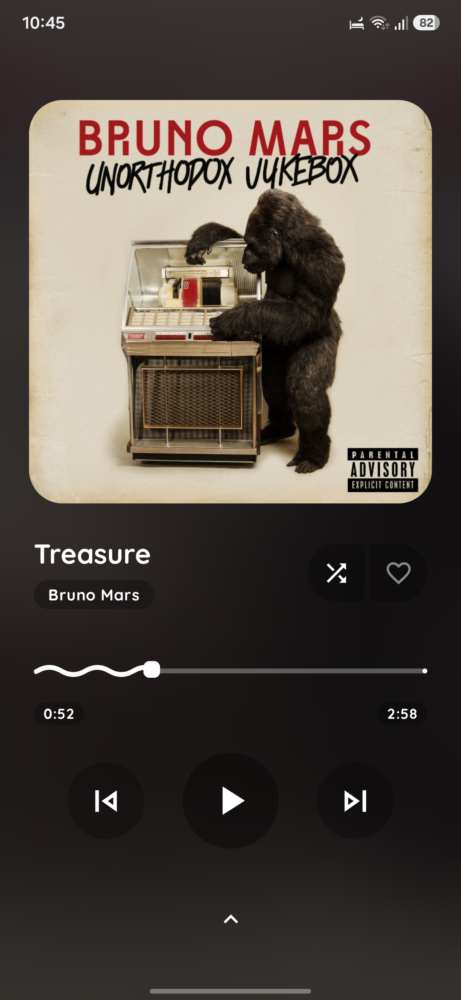
  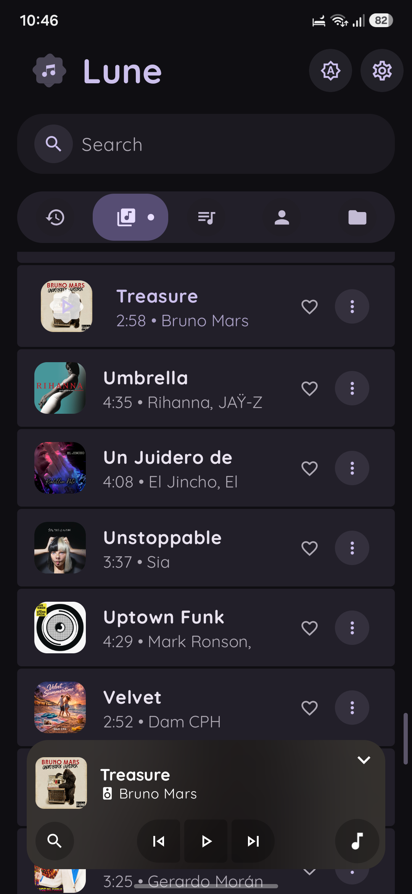
</p>

<p align="center">
  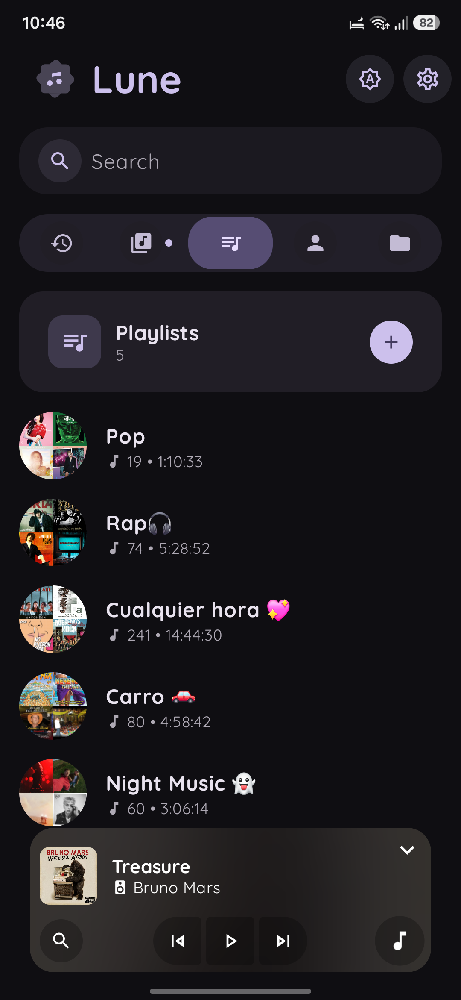
  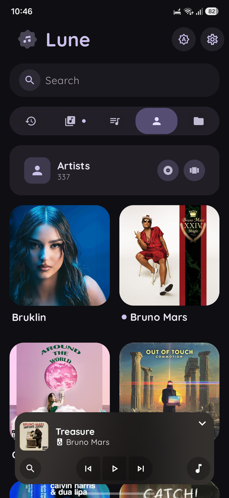
  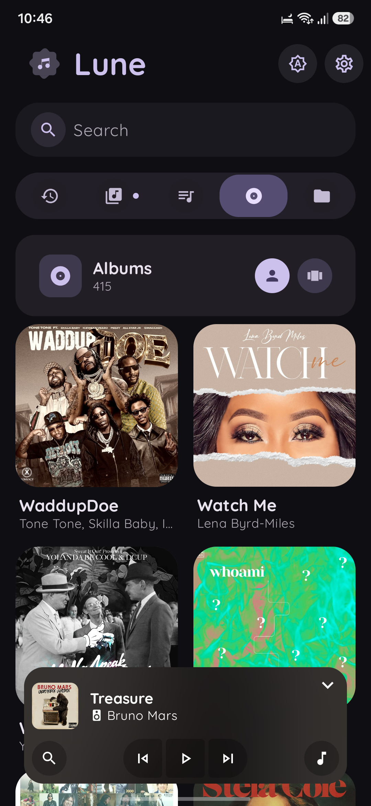
  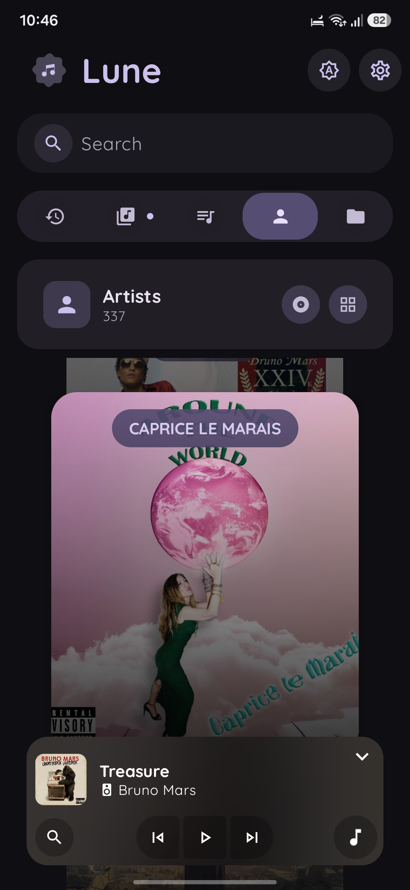
  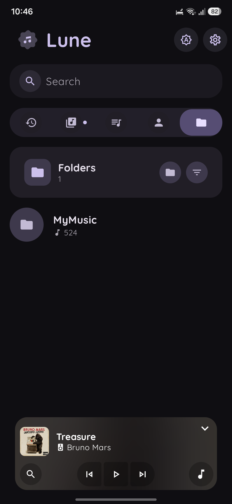
</p>

<p align="center">
  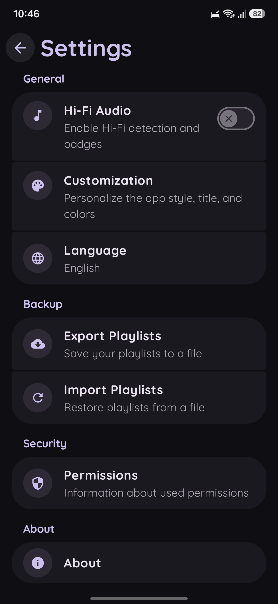
  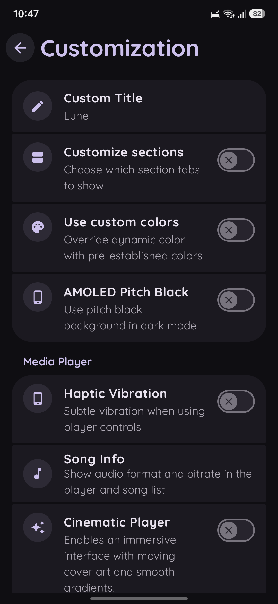
  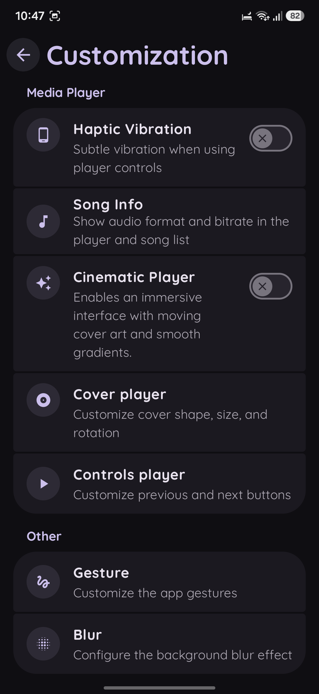
  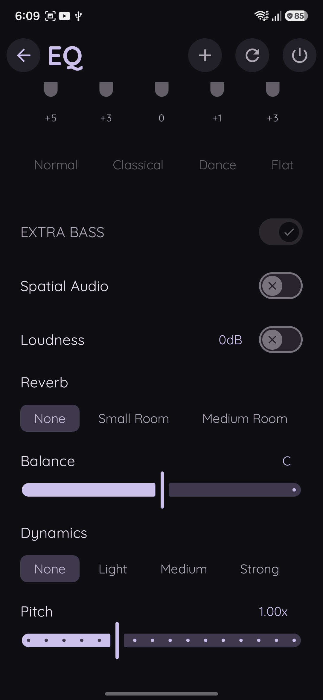
  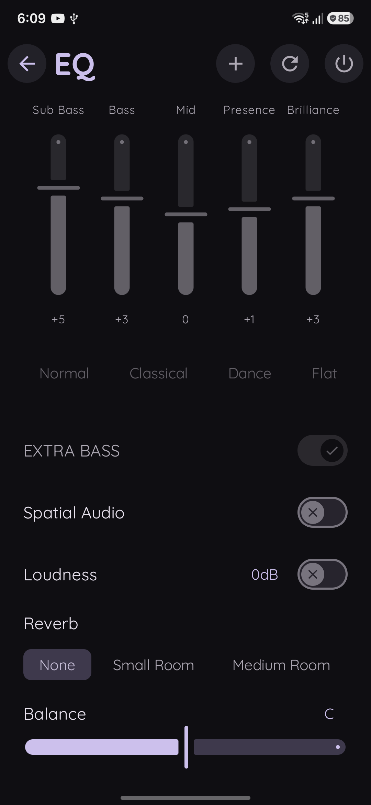
</p>

## 🛠 Build Requirements

To build Lune from source, ensure your environment meets the following requirements:

- **JDK 17+**: Required for the current Gradle build version.
- **Android SDK 36**: The project targets and compiles with the latest Android 15 APIs (SDK 36).
- **Gradle**: Uses the provided Gradle wrapper (8.x+).

Create this file for signing release

**keystore.properties**:

```bash
storeFile=key-file.jks
storePassword=password
keyAlias=alias
keyPassword=password
```

## 🚀 How to Build

1. **Clone the repository**:
   ```bash
   git clone https://github.com/MrDemonc/Lune.git
   cd Lune
   ```
2. **Setup Environment**:
   Ensure `ANDROID_HOME` is set to your local Android SDK location.
3. **Build via Command Line**:
   Run the following command to generate the release APK:
   ```bash
   ./gradlew assembleRelease
   ```
   The output APK will be available at: `app/build/outputs/apk/release/Lune-release.apk`

## Other donation option

### ☕ Monero (XMR)

monero:88s5Re4p6a3P9TtqaG1G2Yeq5Ppp1w1npXebyLjktuxYgurFAGn4GRbKuPKGbx1pD1bBwohtAriL7JqB12ECp4SnMN1T3q9

## 🤝 Credits

- **MrDemonc**: Project Creator & Lead Developer.
- **Desukia**: Design testing and UX feedback.

---

<p align=center>
  <b><i></b>💫Lune - Listen with style💫</i></b>
</p>
